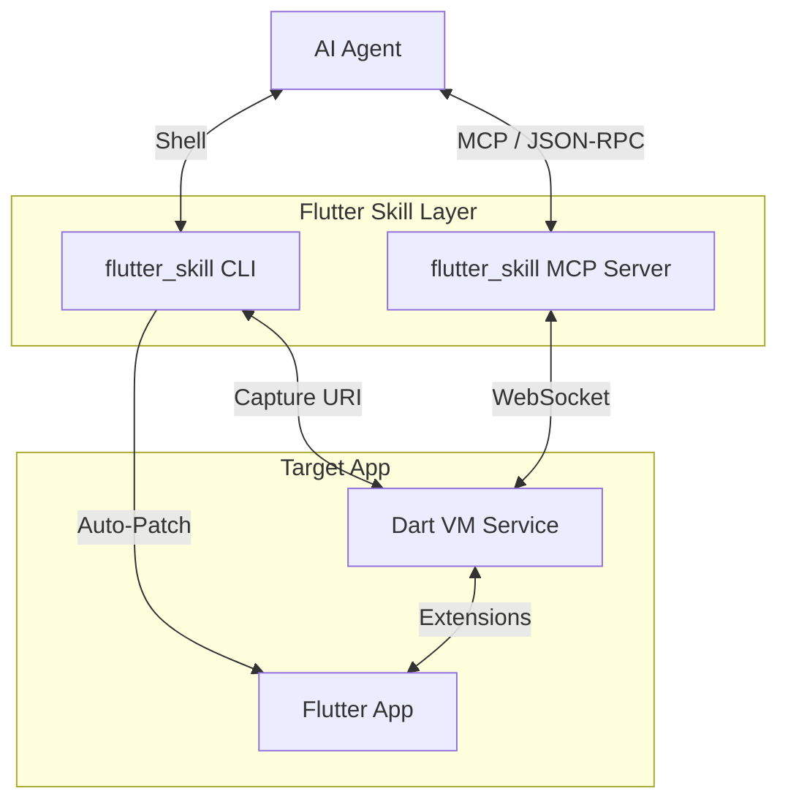

# Flutter Skill

> **Give your AI Agent eyes and hands inside your Flutter app.**


**Flutter Skill** is a bridge that connects AI Agents (like Claude Code, Cursor, Windsurf) directly to a running Flutter application. It creates a bi-directional control channel allowing agents to:

- **Inspect** the UI structure (Widget Tree, Text Content, Element Properties)
- **Act** on widgets (Tap, Double Tap, Long Press, Swipe, Drag, Scroll, Enter Text)
- **Validate** state (Text Values, Checkbox State, Wait for Elements)
- **Capture** screenshots (Full App or Specific Elements)
- **Navigate** (Get Routes, Go Back, View Navigation Stack)
- **Debug** (View Logs, Errors, Performance Metrics)
- **Zero Config** setup (Auto-injects dependencies)

---

## Features

### UI Inspection
| Tool | Description |
|------|-------------|
| `inspect` | Get interactive elements (buttons, text fields, etc.) |
| `get_widget_tree` | Get the full widget tree structure with depth control |
| `get_widget_properties` | Get detailed properties of a widget (size, position, visibility) |
| `get_text_content` | Extract all visible text from the screen |
| `find_by_type` | Find all widgets of a specific type (e.g., ElevatedButton) |

### Interactions
| Tool | Description |
|------|-------------|
| `tap` | Tap a widget by Key or Text |
| `double_tap` | Double tap a widget |
| `long_press` | Long press a widget |
| `swipe` | Swipe gesture (up/down/left/right) globally or on element |
| `drag` | Drag from one element to another |
| `scroll_to` | Scroll to make an element visible |
| `enter_text` | Enter text into a text field |

### State & Validation
| Tool | Description |
|------|-------------|
| `get_text_value` | Get current value of a text field |
| `get_checkbox_state` | Get checked state of a checkbox |
| `get_slider_value` | Get current value of a slider |
| `wait_for_element` | Wait for an element to appear (with timeout) |
| `wait_for_gone` | Wait for an element to disappear (with timeout) |

### Screenshot
| Tool | Description |
|------|-------------|
| `screenshot` | Capture full app screenshot (returns base64 PNG) |
| `screenshot_element` | Capture screenshot of a specific element |

### Navigation
| Tool | Description |
|------|-------------|
| `get_current_route` | Get current route name |
| `get_navigation_stack` | Get navigation history |
| `go_back` | Navigate back to previous screen |

### Debug & Logs
| Tool | Description |
|------|-------------|
| `get_logs` | Fetch application logs |
| `get_errors` | Get error messages |
| `get_performance` | Get performance metrics |
| `clear_logs` | Clear the log buffer |

### Development Tools
| Tool | Description |
|------|-------------|
| `hot_reload` | Trigger hot reload |
| `pub_search` | Search packages on pub.dev |

---

## Architecture



---

## Quick Start

You don't need to manually edit your code. The skill handles it for you.

### 1. Install CLI (Optional)

```bash
# From the flutter-skill directory
dart pub global activate --source path .
```

### 2. Launch with Auto-Setup

```bash
# Using global CLI
flutter_skill launch /path/to/your/flutter_project

# Or run directly
dart run bin/flutter_skill.dart launch /path/to/your/flutter_project
```

**What happens automatically:**
1. Checks for `flutter_skill` dependency. If missing, adds it.
2. Checks `main.dart` for initialization. If missing, injects `FlutterSkillBinding.ensureInitialized()`.
3. Runs `flutter run`.
4. Captures the VM Service URI and saves it to `.flutter_skill_uri`.

### 3. Let the Agent Take Over

**CLI Mode (Claude Code):**
```bash
# Inspect the screen
flutter_skill inspect

# Tap a button
flutter_skill act tap "login_button"

# Enter text
flutter_skill act enter_text "email_field" "hello@example.com"

# Take screenshot
flutter_skill screenshot ./screenshot.png
```

**MCP Mode (Cursor/Windsurf/Claude Desktop):**

Add to your MCP configuration:
```json
{
  "flutter-skill": {
    "command": "dart",
    "args": ["run", "/absolute/path/to/flutter-skill/bin/server.dart"]
  }
}
```

Then tools like `connect_app`, `inspect`, `tap`, `screenshot` become available to the Agent.

---

## CLI Commands

```bash
# Launch app with auto-setup
flutter_skill launch <project_path> [-d <device>]

# Connect to running app
flutter_skill connect <vm_service_uri>

# Inspect UI elements
flutter_skill inspect

# Perform actions
flutter_skill act tap <key_or_text>
flutter_skill act enter_text <key> "text value"
flutter_skill act scroll_to <key_or_text>

# Take screenshot
flutter_skill screenshot [output_path]

# Start MCP server
flutter_skill server
```

---

## Target App Setup (Manual)

*Usually not needed - the launch command handles this automatically.*

**pubspec.yaml**:
```yaml
dependencies:
  flutter_skill:
    path: /path/to/flutter-skill
```

**main.dart**:
```dart
import 'package:flutter_skill/flutter_skill.dart';
import 'package:flutter/foundation.dart';

void main() {
  if (kDebugMode) {
    FlutterSkillBinding.ensureInitialized();
  }
  runApp(const MyApp());
}
```

---

## Widget Keys

For reliable element identification, add `ValueKey` to your widgets:

```dart
ElevatedButton(
  key: const ValueKey('login_button'),
  onPressed: () {},
  child: const Text('Login'),
)
```

The skill can find elements by:
1. **Key** (most reliable): `tap "login_button"`
2. **Text content**: `tap "Login"`
3. **Widget type**: `find_by_type "ElevatedButton"`

---

## Development & Testing

```bash
# Run integration tests against mock app
dart run test/integration_test.dart

# Run the test app
cd test_dummy && flutter run -d macos
```

---

## License

MIT
