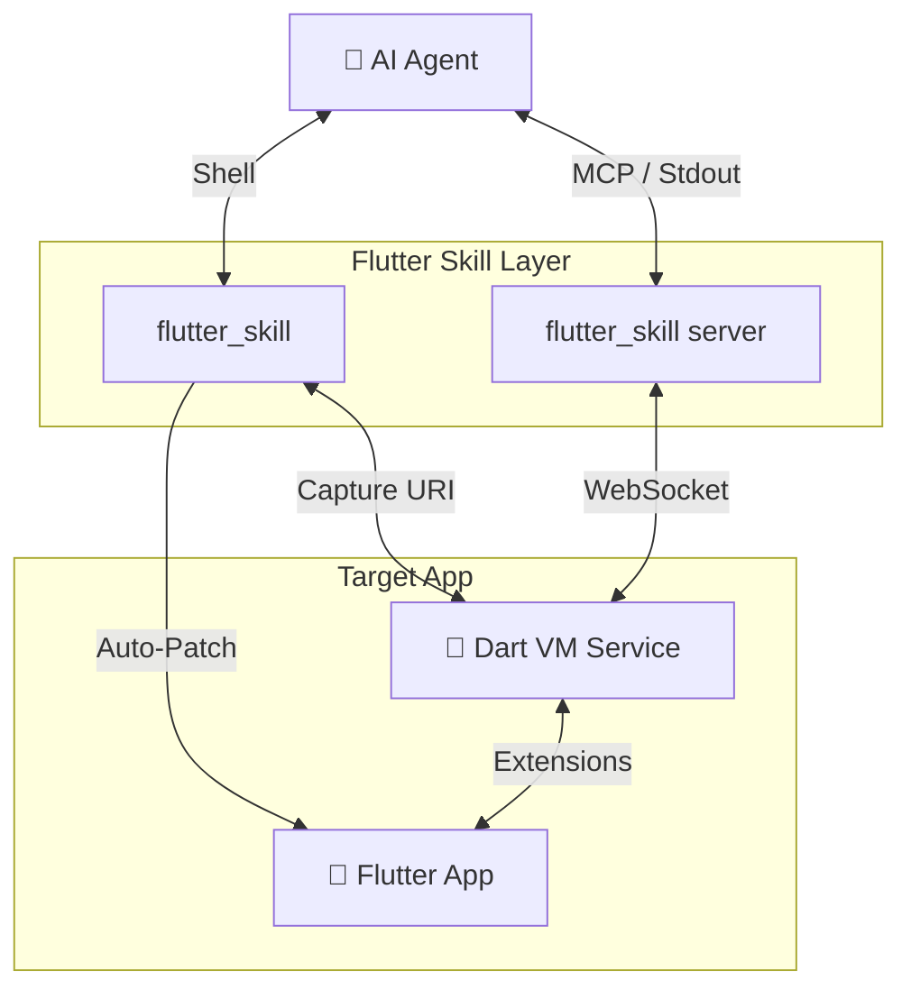

# Flutter Skill 🚀

> **Give your AI Agent eyes and hands inside your Flutter app.**


**Flutter Skill** is a bridge that connects AI Agents (like Claude Code, Cursor, Windsurf) directly to a running Flutter application. It creates a bi-directional control channel allowing agents to:
- 🕵️‍♂️ **Inspect** the UI structure (Accessibility Tree).
- 👆 **Act** on widgets (Tap, Scroll, Enter Text).
- 📸 **Verify** visual changes (Screenshots).
- 🧩 **Zero Config** setup (Auto-injects dependencies).

---

## ✨ Features

- **Zero-Config Automation**: Just run the launch command. The skill automatically adds dependencies and injects initialization code into `main.dart`.
- **Universal Compatibility**: Works as a **CLI tool** (for Claude Code) or an **MCP Server** (for Cursor/Windsurf).
  > **MCP Server Config**:
  > Add to `claude_desktop_config.json`:
  > ```json
  > "flutter-skill": {
  >   "command": "dart",
  >   "args": ["run", "/absolute/path/to/flutter-skill/bin/server.dart"]
  > }
  > ```

- **Resilient Connection**: Uses Dart VM Service Protocol to communicate reliably with Debug/Profile builds.
- **Smart Element Resolution**: Finds widgets by reliability keys, text content, or semantic labels.

---

## 🏗 Architecture



---

## 🚀 Quick Start

You don't need to manually edit your code. The skill handles it for you.

### 1. Launch with Auto-Setup
Run the launch script pointing to your project directory:

```bash
flutter_skill launch /path/to/your/flutter_project
```

**What happens automatically:**
1. Checks for `flutter_skill` dependency. If missing, adds it.
2. Checks `main.dart` for initialization. If missing, injects `FlutterSkillBinding.ensureInitialized()`.
3. Runs `flutter run`.
4. Captures the VM Service URI and saves it to `.flutter_skill_uri`.

### 2. Let the Agent Take Over
Once launched, your Agent has full control using the provided tools.

**CLI Mode (e.g. Claude Code):**
```bash
# Inspect the screen
flutter_skill inspect

# Tap a button
flutter_skill act tap "login_button"
```

**MCP Mode (e.g. Cursor):**
- Configure the MCP server in your editor settings.
- unique tools like `connect_app`, `get_layout`, `tap` become available to the Agent.

---

## 🛠 Tools Reference

| Tool | Description |
|------|-------------|
| `launch_app` | Zero-config launch & auto-instrumentation. |
| `connect_app` | Connects to an already running app via URI. |
| `get_layout` | Dumps the current UI hierarchy (Semantics/Widget tree). |
| `tap` | Taps a widget by Key, Text, or Semantics Label. |
| `enter_text` | Enters text into a focused input field. |
| `scroll` | Scrolls to a specific item. |
| `get_logs` | Fetches recent console logs from the app. |

---

## 🧪 Development & Verification

We include a **Sandbox Environment** to verify the skill without a physical device or emulator.

```bash
# Run the full integration test suite against a Mock App
dart run tests/integration_test.dart
```

This verifies:
- Dependency injection logic.
- Code patching logic.
- VM Service protocol negotiation.
- Command execution.

---

## 📄 License

MIT
