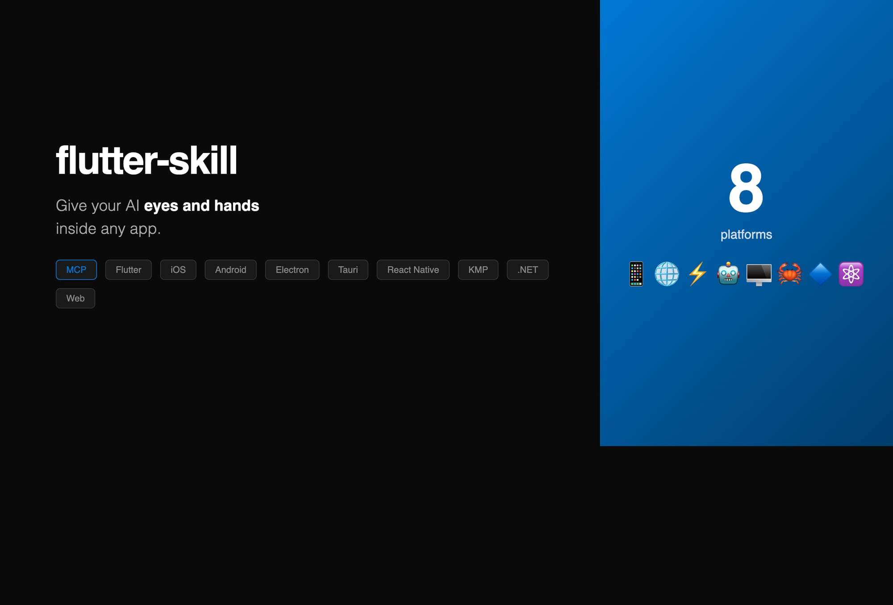

<p align="center">
  
</p>

<h1 align="center">flutter-skill</h1>

<p align="center">
  <strong>Give your AI eyes and hands inside any app.</strong><br>
  E2E testing bridge for Claude, Cursor, Windsurf — across 8 platforms.
</p>

<p align="center">
  <a href="https://pub.dev/packages/flutter_skill"></a>
  <a href="https://www.npmjs.com/package/flutter-skill"></a>
  <a href="https://github.com/ai-dashboad/flutter-skill/actions"></a>
  <a href="https://github.com/ai-dashboad/flutter-skill/stargazers"></a>
  <a href="LICENSE"></a>
</p>

<p align="center">
  <a href="#quick-start">Quick Start</a> •
  <a href="#platforms">Platforms</a> •
  <a href="#what-can-it-do">Features</a> •
  <a href="#install">Install</a> •
  <a href="docs/USAGE_GUIDE.md">Docs</a>
</p>

---

<p align="center"></p>

```
You: "Test the login flow — enter test@example.com and password123, tap Login, verify Dashboard"

AI Agent:
  1. screenshot()        → sees the login screen
  2. enter_text("email") → types the email  
  3. enter_text("pass")  → types the password
  4. tap("Login")         → taps the button
  5. wait_for_element("Dashboard") → confirms navigation
  ✅ Login flow verified!
```

**No test code. No selectors. Just tell the AI what to test.**

---

## Quick Start

**1. Install**

```bash
npm install -g flutter-skill        # npm (recommended)
# or: brew install ai-dashboad/flutter-skill/flutter-skill
# or: dart pub global activate flutter_skill
```

**2. Add to your MCP config** (Claude Code / Cursor / Windsurf)

```json
{
  "mcpServers": {
    "flutter-skill": {
      "command": "flutter-skill",
      "args": ["server"]
    }
  }
}
```

**3. Add to your app** (2 lines)

```dart
import 'package:flutter_skill/flutter_skill.dart';

void main() {
  if (kDebugMode) FlutterSkillBinding.ensureInitialized();
  runApp(MyApp());
}
```

**4. Test** — just talk to your AI:

> *"Launch my app, tap Sign Up, fill the form, and verify the success screen"*

That's it. Zero configuration.

<details>
<summary><strong>📦 More install methods</strong> (Windows, Docker, IDE extensions)</summary>

| Method | Command | Platform |
|--------|---------|----------|
| npm | `npm install -g flutter-skill` | All |
| Homebrew | `brew install ai-dashboad/flutter-skill/flutter-skill` | macOS/Linux |
| Scoop | `scoop install flutter-skill` | Windows |
| One-click | `curl -fsSL .../install.sh \| bash` | macOS/Linux |
| Windows | `iwr .../install.ps1 -useb \| iex` | Windows |
| Docker | `docker pull ghcr.io/ai-dashboad/flutter-skill` | All |
| pub.dev | `dart pub global activate flutter_skill` | All |
| VSCode | Extensions → "Flutter Skill" | All |
| IntelliJ | Plugins → "Flutter Skill" | All |

</details>

<details>
<summary><strong>🔧 Zero-config onboarding</strong> (auto-detect & patch your app)</summary>

```bash
cd your-app/
flutter-skill init    # Detects platform, patches entry point, configures MCP
flutter-skill demo    # Launches built-in demo app to try it out
```

`init` auto-detects Flutter, iOS, Android, React Native, or Web projects and patches them automatically.

</details>

---

## Platforms

flutter-skill works across **8 platforms** with a unified bridge protocol:

| Platform | SDK | Tests | Status |
|----------|-----|-------|--------|
| **Flutter iOS** | `flutter_skill` (pub.dev) | 21/21 ✅ | Stable |
| **Flutter Web** | `flutter_skill` (pub.dev) | 20/20 ✅ | Stable |
| **Electron** | [`sdks/electron`](sdks/electron/) | 24/24 ✅ | Stable |
| **Android** (Kotlin) | [`sdks/android`](sdks/android/) | 24/24 ✅ | Stable |
| **KMP Desktop** | [`sdks/kmp`](sdks/kmp/) | 22/22 ✅ | Stable |
| **Tauri** (Rust) | [`sdks/tauri`](sdks/tauri/) | 23/24 ✅ | Stable |
| **.NET MAUI** | [`sdks/dotnet-maui`](sdks/dotnet-maui/) | 23/24 ✅ | Stable |
| **React Native** | [`sdks/react-native`](sdks/react-native/) | 24/24 ✅ | Stable |

> **181/183 tests passing** across all platforms (99% pass rate)

Each SDK README has platform-specific setup instructions. The same CLI and MCP tools work for all platforms.

<details>
<summary><strong>Platform setup examples</strong></summary>

**Web** — add one script tag:
```html
<script src="flutter-skill.js"></script>
<script>FlutterSkill.start({ port: 50000 });</script>
```

**React Native** — npm install:
```bash
npm install flutter-skill
```
```js
import FlutterSkill from 'flutter-skill';
FlutterSkill.start();
```

**iOS (Swift/SwiftUI)** — Swift Package Manager:
```swift
import FlutterSkill
FlutterSkillBridge.shared.start()

Text("Hello").flutterSkillId("greeting")
Button("Submit") { submit() }.flutterSkillButton("submitBtn")
```

**Android (Kotlin)** — Gradle:
```kotlin
implementation("com.flutterskill:flutter-skill:0.7.4")
FlutterSkillBridge.start(this)
```

**Electron / Tauri / KMP / .NET** — see each SDK's README for details.

</details>

---

## What Can It Do?

**40+ MCP tools** organized in 4 categories:

<table>
<tr>
<td width="50%" valign="top">

### 👀 See the Screen
- `screenshot` — full app screenshot
- `inspect` — list all interactive elements
- `get_widget_tree` — full widget hierarchy
- `find_by_type` — find by widget type
- `get_text_content` — extract all text

</td>
<td width="50%" valign="top">

### 👆 Interact Like a User
- `tap` / `double_tap` / `long_press`
- `enter_text` — type into fields
- `swipe` / `scroll_to` / `drag`
- `go_back` — navigate back
- Native: `native_tap`, `native_swipe`

</td>
</tr>
<tr>
<td valign="top">

### ✅ Verify & Assert
- `assert_text` / `assert_visible`
- `wait_for_element` / `wait_for_gone`
- `get_checkbox_state` / `get_slider_value`
- `assert_element_count`

</td>
<td valign="top">

### 🚀 Launch & Control
- `launch_app` — launch with flavors/defines
- `scan_and_connect` — find running apps
- `hot_reload` / `hot_restart`
- `list_sessions` / `switch_session`

</td>
</tr>
</table>

<details>
<summary><strong>Full tool reference (40+ tools)</strong></summary>

**Launch & Connect:** `launch_app`, `scan_and_connect`, `hot_reload`, `hot_restart`, `list_sessions`, `switch_session`, `close_session`

**Screen:** `screenshot`, `screenshot_region`, `screenshot_element`, `native_screenshot`, `inspect`, `get_widget_tree`, `find_by_type`, `get_text_content`

**Interaction:** `tap`, `double_tap`, `long_press`, `enter_text`, `swipe`, `scroll_to`, `drag`, `go_back`, `native_tap`, `native_input_text`, `native_swipe`

**Assertions:** `assert_text`, `assert_visible`, `assert_not_visible`, `assert_element_count`, `wait_for_element`, `wait_for_gone`, `get_checkbox_state`, `get_slider_value`, `get_text_value`

**Debug:** `get_logs`, `get_errors`, `get_performance`, `get_memory_stats`

</details>

---

## Example Workflows

```
"Test login with test@example.com / password123, verify it reaches the dashboard"

"Submit the registration form empty and check that all validation errors appear"

"Navigate through all tabs, screenshot each one, verify back button works"

"Take screenshots of home, profile, and settings — compare with last time"
```

The AI agent figures out the steps. No test code needed.

---

## Native Platform Support

Flutter Skill sees through native dialogs that Flutter can't — permission popups, photo pickers, share sheets:

| Capability | iOS Simulator | Android Emulator |
|-----------|--------------|-----------------|
| Screenshot | `xcrun simctl` | `adb screencap` |
| Tap | macOS Accessibility | `adb input tap` |
| Text input | Pasteboard + Cmd+V | `adb input text` |
| Swipe | Accessibility scroll | `adb input swipe` |

No external tools needed — uses built-in OS capabilities.

---

## Troubleshooting

| Problem | Fix |
|---------|-----|
| "Not connected" | `flutter-skill scan_and_connect` to auto-find apps |
| "Unknown method" | `flutter pub add flutter_skill` then restart (not hot reload) |
| No VM Service URI | Add `--vm-service-port=50000` to launch args |
| Claude Code priority | Run `flutter_skill setup` for priority rules |

📖 **Full docs:** [Usage Guide](docs/USAGE_GUIDE.md) · [Architecture](docs/ARCHITECTURE.md) · [Troubleshooting](docs/TROUBLESHOOTING.md) · [Flutter 3.x Fix](docs/FLUTTER_3X_FIX.md)

---

## Links

<table>
<tr>
<td>

📦 **Install**
- [pub.dev](https://pub.dev/packages/flutter_skill)
- [npm](https://www.npmjs.com/package/flutter-skill)
- [Homebrew](https://github.com/ai-dashboad/homebrew-flutter-skill)

</td>
<td>

🔌 **IDE Extensions**
- [VSCode Marketplace](https://marketplace.visualstudio.com/items?itemName=ai-dashboad.flutter-skill)
- [JetBrains Marketplace](https://plugins.jetbrains.com/plugin/29991-flutter-skill)

</td>
<td>

📖 **Docs**
- [Roadmap](docs/ROADMAP.md)
- [Changelog](CHANGELOG.md)
- [Architecture](docs/ARCHITECTURE.md)

</td>
</tr>
</table>

---

<p align="center">
  <strong>If flutter-skill saves you time, <a href="https://github.com/ai-dashboad/flutter-skill">⭐ star it on GitHub</a>!</strong>
</p>

<p align="center">
  <a href="https://github.com/sponsors/ai-dashboad">GitHub Sponsors</a> · <a href="https://buymeacoffee.com/ai-dashboad">Buy Me a Coffee</a>
</p>

<p align="center">MIT License</p>
